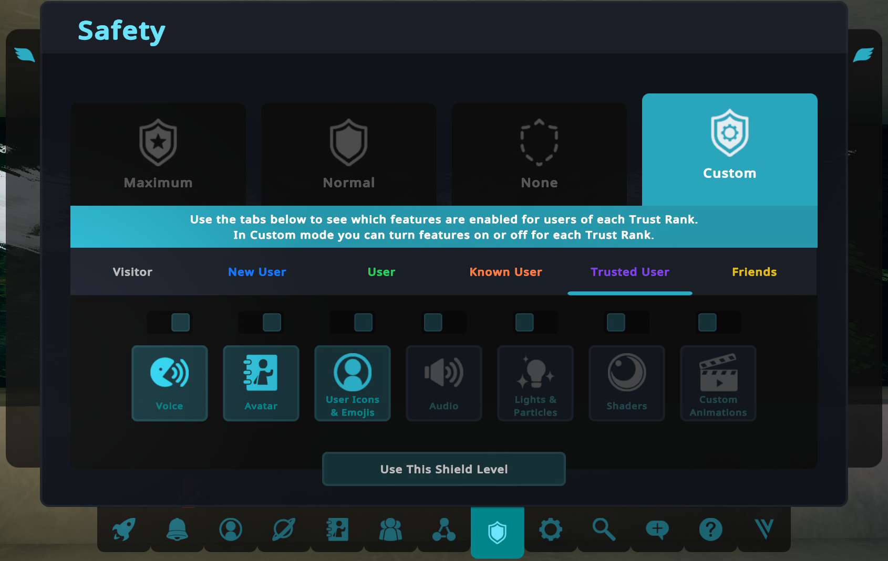
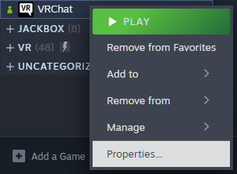
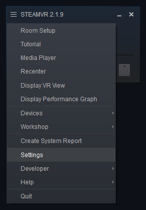

# How to Maximize Your FPS in VRChat

This is a guide on what software settings you can change - both in and out of VRChat - in order to get the most performance possible. Please note that performance gains are made by sacrificing some quality, so I encourage you to change your settings around and find a balance that you're happy with. While this guide has a PCVR focus, you should be able to apply the non-VR changes and increase your FPS in desktop mode (or on Quest) as well.

If you are looking for hardware recommendations, I recommend checking out [Tupper's guide](https://tupper.notion.site/The-Current-Best-PC-For-VRChat-0636cbf57062499e80f02554afda2be4). It's very good, and goes in-depth about what hardware specs you want to look for. For hardware recommendations on a budget, I recommend asking [/r/buildmeapc](https://reddit.com/r/buildmeapc/).

## Summary
**This guide might be longer than some people want, so here is a brief summary of the changes you can make that have the biggest impact on FPS:**
- Set your headset refresh rate to 90hz
- Set your headset resolution to 80%
- Use the avatar hider in the mini menu settings (e.g. 40m and max 20)
- Set Multisample Anti-Aliasing to 2x in performance settings
- Turn off avatar shaders in safety settings

If you want more detail or information on where these settings are, please see below! Key parts are bolded.

## In-Game Performance Settings


### Block Poorly Optimized Avatars
While you can block very poor or poor avatars with this setting, **I recommend turning off avatar shaders instead (see [Safety Settings](#in-game-safety-settings))**. This allows you to see a general idea of what an avatar looks like, rather than seeing the "Perf Blocked" robot avatar.

### Max Avatar Download Size
**This won't have a direct effect on your FPS**, but larger avatars tend to be worse quality, so limiting size can indirectly increase your FPS. Rather than changing this, I again recommend turning off avatar shaders instead.

### Dynamic Bones
**Make sure "Convert To PhysBone" is checked.** This will automatically convert Dynamic Bones on old avatars to PhysBones, which is VRChat's optimized implementation.

### Managed Cached Data
**This won't have a direct effect on your FPS**, and clearing it will make you re-download avatars/worlds you had cached, so I recommend leaving it alone. VRChat automatically manages the cache.

### Advanced Graphics Settings
Max Performance:
- Graphics Quality: Low
- **Multisample Anti-Aliasing: 2x**
- Particle Limiter: ✅
- Forced Camera Near Distance: ❌
- Mirror Resolution: Quarter Resolution

**Turning MSAA off completely can have a big impact on quality, as well as break some worlds/shaders, so I recommend a 2x minimum.**

## Avatar Hider Settings
You can only access these settings from the mini menu.


**By lowering the distance or number of avatars you show, you'll increase your FPS**, but you'll see more diamond avatar replacements. The settings I currently use are 40m and 20.

## In-Game Safety Settings



These are the safety settings that I use for all trust levels. A decent amount of GPU processing is spent on shaders, so **I recommend turning off shaders for non-friends of all trust levels**. If you have a large number of friends in an instance, you can also turn off friends' shaders to gain FPS. This will make some avatars look weird (like making them entirely one color), but you'll be able to generally see what avatars look like, and you can then decide if you want to show their avatar or not. Manually showing someone's avatar overrides this setting, regardless of trust level.

## Game Launch Settings




While in VR, VRChat also runs in a desktop window on your computer. Making this window smaller can increase headset FPS. To do this, open VRChat's properties on Steam by right-clicking on the game in your library, and add the following to the Launch Options:

```-screen-width 640 -screen-height 480```

Please note that the in-game Stream Camera uses the desktop window for output. If you are streaming/recording, you will want to leave this alone, or maximize the window before streaming/recording.

## Headset Settings

I only have a Valve Index so I can't speak for all headsets, but every headset *should* have a settings menu where you can adjust refresh rate and render resolution. To access the SteamVR settings, make sure your headset is plugged in and turned on, then click the hamburger menu in the top left corner of the SteamVR window.




**The lower the render resolution, the higher your FPS.** In my experience, you can lower this to 80-90% and not be able to tell the difference in quality at all, while increasing your FPS.

Additionally, **lowering your refresh rate can also increase your performance**, but the lower refresh rate can be very noticeable. I don't recommend going lower than 90hz.

## Other Tips

These aren't directly related to VRChat/VR, but they can increase your performance as well:
- Apply any Windows updates and restart your computer before launching VRChat
- Make sure your graphics drivers are up to date
- Close un-needed apps (and make sure they're actually closed, not just minimized in the taskbar)

## Conclusion

Thanks for reading! I hope my guide was able to help you increase your FPS in VRChat. If you have any comments/questions/etc, please feel free to [open an issue](https://github.com/shugy0/max-vrchat-fps/issues).

The world in the background of the screenshots is [Usedom by Bigby](https://vrchat.com/home/world/wrld_fa5eaf88-8df8-4afa-96ce-01d19a924554).

DISCLAIMER: The information in this guide is provided for educational purposes only. The author and publisher are not responsible for any damage that may result from following the information in this guide. Use the information in this guide at your own risk.

LICENSE: https://creativecommons.org/licenses/by/4.0/