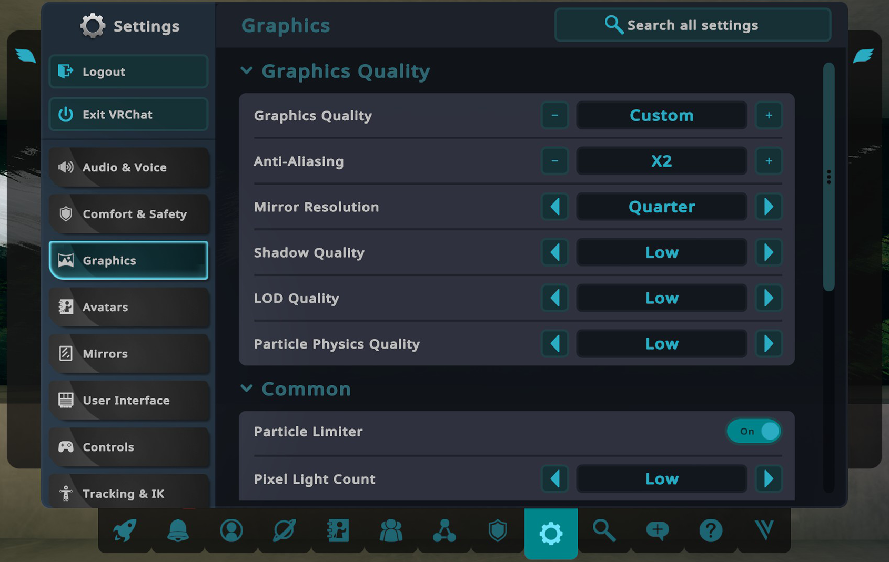
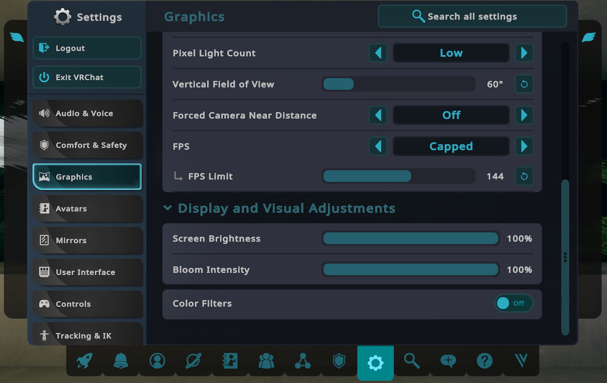
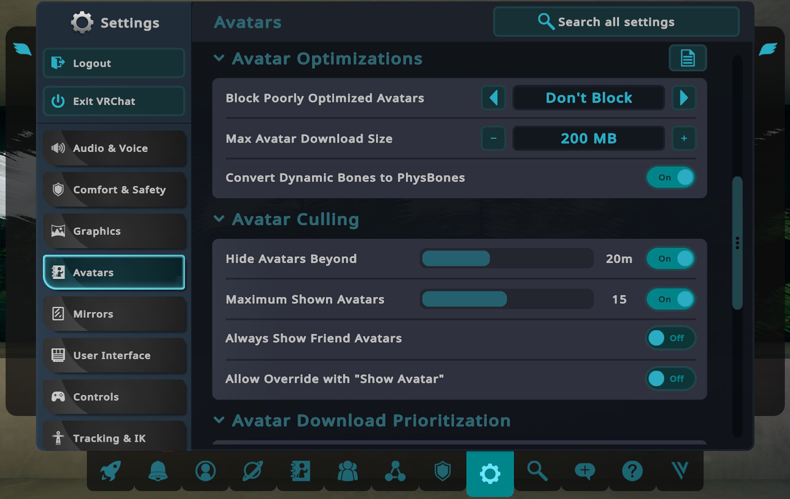
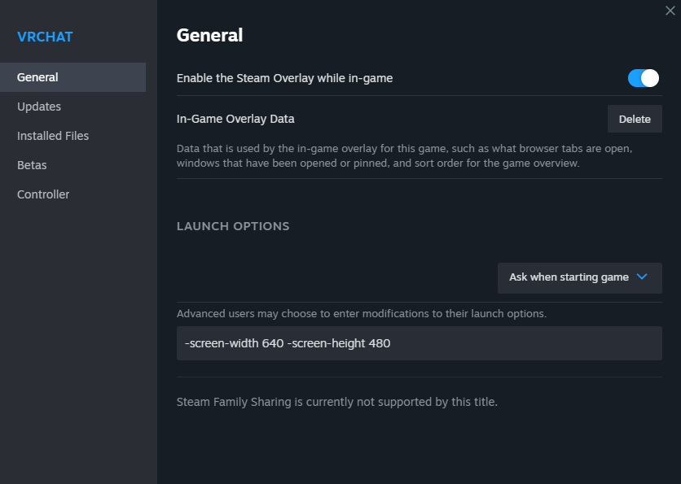

# How to Maximize Your FPS in VRChat

This is a guide that explains what software settings you can change - both in and out of VRChat - in order to get the most performance or FPS possible. Please note that performance gains are made by sacrificing some quality, so I encourage you to try changing settings and find a balance that you're happy with. While this guide has a PCVR focus, you should be able to apply the non-VR changes and increase your FPS in desktop mode (or on Android) as well.

If you are looking for computer hardware recommendations, I recommend checking out [Tupper's guide](https://tupper.notion.site/The-Current-Best-PC-For-VRChat-0636cbf57062499e80f02554afda2be4). It's very good, and goes in-depth about what hardware specs you want to focus on to maximize performance.

For hardware recommendations on a budget, I recommend asking [/r/buildmeapc](https://reddit.com/r/buildmeapc/).

Some few things you need to keep in mind when building PC for VRChat specifically:

- VRChat specifically LOVES AMD 3D V-Cache CPUs. Buying Ryzen 7 5600X3D, Ryzen 7 5800X3D, Ryzen 7 7800X3D or Ryzen 9 7950X3D is strongly recommended. If your budget allows buying those CPUs they are no brainer. If your budget does not allow any of those, use 2nd tip.
- VRChat is a CPU heavy game. Prioritize strong single thread performance over multi cores if you can. For example a Ryzen 5 5600X (6 core) is a better buy than a Ryzen 7 3700X (8 core) due to better IPC and single thread performance.
- To ensure comfort, VR games are better when you balance frames and resolution to minimize motion sickness. Running at high resolution will require a lot of VRAM and it is recommended to get at least 8GB VRAM for budget builds and combine with OpenVR Dynamic Resolution (guide below under advanced SteamVR tips).

Paste them when you need to ask for help.

## Summary
**This is a detailed guide, so here is a brief summary of the changes you can make that have the biggest impact on FPS:**

**In game VRChat client side**
- Turn on avatar culling (e.g. 20m and max 15)
- Set Anti-Aliasing to x2
- Turn off avatar shaders
- Turn off nameplates in crowded instances

**SteamVR and more**
- Set your headset refresh rate to 90hz
- Set your headset resolution to 80%
- Avoid software layers like Oculus Software with Virtual Desktop or Steam Link
- Make use of adjusting resolution.

If you want more details or information on where these settings are located, please keep reading! Key parts are bolded.

## In-Game Graphics and Avatar Settings







### Block Poorly Optimized Avatars
While you can block very poor or poor avatars with this setting, **I recommend turning off avatar shaders instead (see [Safety Settings](#in-game-safety-settings))**. This allows you to see a general idea of what an avatar looks like, rather than seeing the "Perf Blocked" robot avatar.

### Max Avatar Download Size
**This won't have a direct effect on your FPS**, but larger avatars tend to be worse quality, so limiting size can indirectly increase your FPS. Rather than changing this, I again recommend turning off avatar shaders instead.

### Dynamic Bones
**Make sure "Convert Dynamic Bones To PhysBones" is On.** This will automatically convert Dynamic Bones on old avatars to PhysBones, which is VRChat's optimized implementation.

### Graphics Settings
Max Performance:
- **Anti-Aliasing: x2**
- Mirror Resolution: Quarter
- Shadow Quality: Low
- LOD Quality: Low
- Particle Physics Quality: Low
- Particle Limiter: On
- Pixel Light Count: Low

**Turning Anti-Aliasing off can have a large negative impact on quality, as well as break some worlds/shaders, so I recommend an x2 minimum.** Addtionaly, it's possible to change Pixel Light Count to Off, but this can also have a large negative impact on quality, so I recommend Low.

### Avatar Culling Settings

**By lowering the avatar culling distance or number of avatars you show, you'll increase your FPS**, but you'll see more diamond avatar replacements.

### Additional Settings

**Turning off nameplates in crowded instances can increase your FPS.** The quickest way to access this setting is the mini menu Settings tab.

## In-Game Safety Settings


These are the safety settings that I use for all trust levels. A decent amount of GPU processing is spent on shaders, so **I recommend turning off shaders for non-friends of all trust levels**. If you have a large number of friends in an instance, you can also turn off friends' shaders to gain FPS. This will make some avatars look weird (like making them entirely one color), but you'll be able to generally see what avatars look like, and you can then decide if you want to show their avatar or not. Manually showing someone's avatar overrides this setting, regardless of trust level.

## Game Launch Settings




While in VR, VRChat also runs in a desktop window on your computer. Making this window smaller can increase headset FPS. To do this, open VRChat's properties on Steam by right-clicking on the game in your library, and add the following to the Launch Options:

```-screen-width 640 -screen-height 480```

Please note that the in-game Stream Camera uses the desktop window for output. If you are streaming/recording, you will want to leave this alone, or maximize the window before streaming/recording.

## Headset Settings

The best way to minimize performance penalty is to have as little software layers as possible. For example the best way to play SteamVR games like VRChat is to run it on either SteamVR native headsets in Steam or run VRChat in your own platform store (ie. Oculus Software or Viveport store) so you do not have to run more on top of SteamVR. In this guide we will focus on SteamVR even when you are in other platform.

SteamVR native headsets are headsets that can run SteamVR directly without any additional software on top like Valve Index or HTC Vive. Headsets like Oculus (Meta) Quest normally requires to run Oculus Software on top which takes performance penalty and VRAM away due to your game will constantly run Oculus software in the background.

### Optimization tips for Oculus Quest platform headset specific

The default way to run SteamVR using any Oculus Quest headsets goes like this:

Oculus Quest -> **Oculus Software** -> SteamVR -> Game

Notice that we need Oculus Software in the middle that we do not have to with other headsets. This extra step is known to cause issue (Specifically Oculus Dash running in background) that eats some performance (like few hundred megabytes of VRAM and some CPU). By eliminating that second layer you can save some additional performance.

So how can I eliminate this Oculus Software layer?

There are some ways.

- Virtual Desktop ($19.99): This is known to be best way to run PCVR on Quest headsets. It is also not free and requires internet connection for every update.
- Steam Link (Free): Valve latest software with the best value you can get for running SteamVR.
- ALVR (Free, FOSS): Free and open source alternative that does not use Oculus Software.
- OculusKiller: OculusKiller is a special way that allows running Oculus Software without running Oculus Dash software in the background. Basically this software will only keep the bare minimum required to run the headset (Any Oculus/Meta compatible headsets), saving resources meanwhile. Check out here: https://github.com/BunniKaitlyn/OculusKiller

*Subject to headset software update. Oculus Quest 1 may not be able to take advantage of those due to discontinued updates.

### Optimization tips for Oculus Rift platform headset specific

As explained in Quest section, use OculusKiller.

### Optimization tips for every headsets for SteamVR

*If you want more advanced, automated way to adjust resolution, skip to next part that uses OpenVR Dynamic Resolution*

Every headset *should* have a settings menu where you can adjust refresh rate and render resolution. To access the SteamVR settings, make sure your headset is plugged in and turned on, then click the hamburger menu in the top left corner of the SteamVR window.


**The lower the render resolution, the higher your FPS.** In my experience, you can lower this to 80-90% and not be able to tell the difference in quality at all, while increasing your FPS.

Additionally, **lowering your refresh rate can also increase your performance**, but the lower refresh rate can be very noticeable. I don't recommend going lower than 90hz.

### Optimization tips for every headsets for SteamVR (Advanced)

Not every situation, every world have equal performance in VRChat. Some may run terrible while some run very well. To optimize this, you can use OpenVR Dynamic Resolution.

*What does this OpenVR Dynamic Resolution do?*

> OpenVR app that dynamically adjusts the HMD's resolution to the GPU frametime, CPU frametime and VRAM.
This allows you to always have the maximum resolution your GPU can handle while hitting your target FPS (without reprojecting). Useful for games in which GPU requirement varies a lot (e.g. VRChat).
This is not the same as SteamVR's Auto Resolution, which seems to be using some benchmarking approach that does not work for the same as OVRDR.

Check out here: https://github.com/Louka3000/OpenVR-Dynamic-Resolution

Basically, this software allows more control over auto resolution to adjust according to your PC resource. The quality will increase or decrease depending on how much system resource your PC have.

## Other Tips

These aren't directly related to VRChat/VR, but they can increase your performance as well:
- Apply any Windows updates and restart your computer before launching VRChat
- Make sure your graphics drivers are up to date
- Close un-needed apps (and make sure they're actually closed, not just minimized in the taskbar)

## Conclusion

Thanks for reading! I hope my guide was able to help you increase your FPS in VRChat. If you have any comments/questions/etc, please feel free to [open an issue](https://github.com/shugy0/max-vrchat-fps/issues).

The world in the background of the screenshots is [Moment by Alia-](https://vrchat.com/home/world/wrld_f3e56230-2bd9-4688-86eb-e24fa3e4c595).

DISCLAIMER: The information in this guide is provided for educational purposes only. The author and publisher are not responsible for any damage that may result from following the information in this guide. Use the information in this guide at your own risk.

LICENSE: https://creativecommons.org/licenses/by/4.0/
